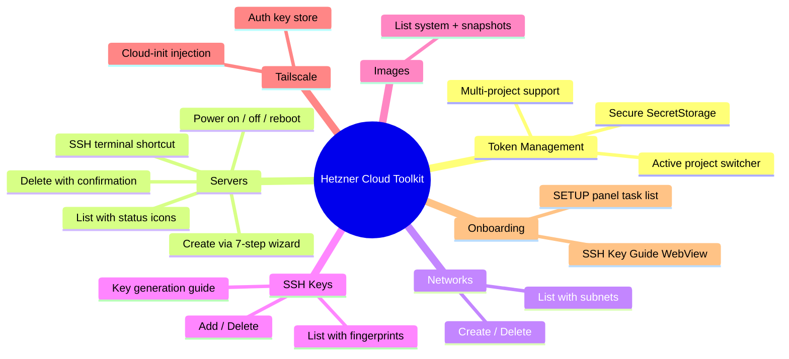
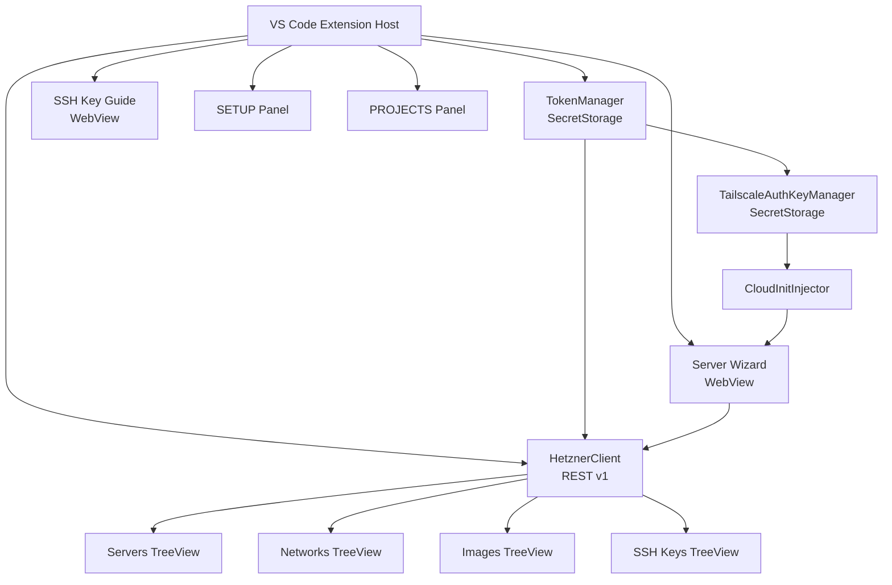
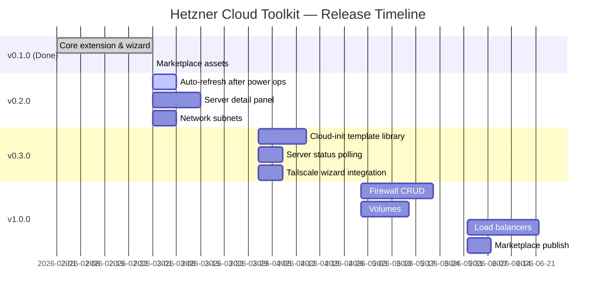

# Roadmap — Hetzner Cloud Toolkit

> A VS Code extension for managing [Hetzner Cloud](https://www.hetzner.com/cloud) infrastructure directly from the editor.
> This is an unofficial community extension, unaffiliated with Hetzner Online GmbH.

---

## Current State — v0.1.0

The initial release is feature-complete and marketplace-ready.

---

## Architecture

---

## Release Plan

---

## Backlog

### v0.2.0 — Polish

| # | Feature | Notes |
|---|---------|-------|
| 1 | **Auto-refresh trees after power actions** | After start/stop/reboot, `serversProvider.refresh()` auto-fires |
| 2 | **Server detail WebView** | Click a server → panel with IPs, specs, datacenter, Hetzner console link |
| 3 | **Network subnets** | Expand network node to show subnets; add/remove subnet commands |
| 4 | **SSH key auto-select after add in wizard** | Newly added key pre-selected when wizard step reloads |

### v0.3.0 — Productivity

| # | Feature | Notes |
|---|---------|-------|
| 5 | **Cloud-init template library** | Save/load named templates via SecretStorage |
| 6 | **Server status polling** | Poll while `initializing`, update tree icon live |
| 7 | **Tailscale key linked into wizard** | Warn/prompt if Tailscale toggled on but no key stored |

### v1.0.0 — Full Coverage

| # | Feature | Notes |
|---|---------|-------|
| 8 | **Firewall rules CRUD** | List, create, apply, delete Hetzner Firewalls |
| 9 | **Volumes** | Block storage attach / detach |
| 10 | **Load balancers** | Basic CRUD |
| 11 | **Marketplace publish** | `vsce package` + `vsce publish` — assets already ready |

### Future Ideas

| # | Feature | Notes |
|---|---------|-------|
| 12 | **Multiple API tokens per project** | Support adding multiple tokens for same project (token rotation, different access levels). Current: 1 token = 1 project. Note: Hetzner Cloud API tokens are per-project only (no global account token exists). |
| 13 | **Token metadata & labels** | Label tokens by purpose (e.g. "Production Read-Only", "Staging Full Access") for better organization |
| 14 | **API token health check** | Periodic validation to detect expired/revoked tokens; show warning icon in Projects tree |

---

## Contributing

Contributions, bug reports, and feature requests are welcome.
Open an [issue](https://github.com/brwinnov/vscode-hetzner-cloud/issues) or submit a PR.

This extension uses **no external runtime dependencies** — just native `fetch` and the VS Code API.
